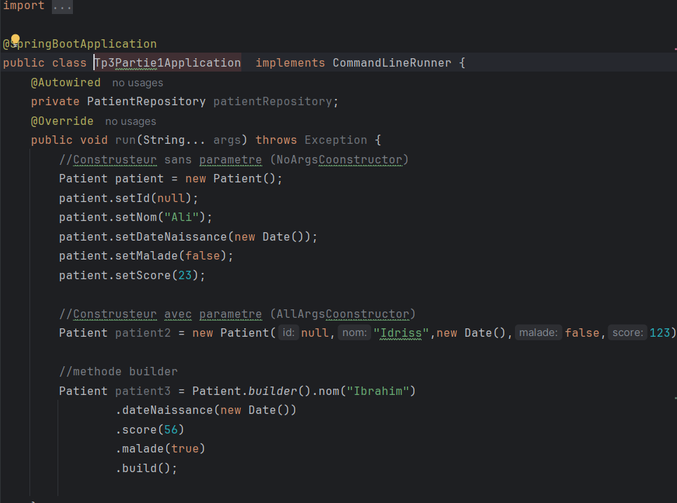

# GUINDO BADARA ALIOU MSDIA FSM
# MASSAR 2100000017

# TP 3 PARTIE 1

## Introduction

Ce travail pratique a pour objectif la mise en place d'une application web simple de gestion de patients à l'aide de Spring Boot.  
Nous y abordons plusieurs aspects essentiels du développement web : la création d'entités, la communication avec une base de données, la pagination, la recherche, et l'amélioration de l'interface utilisateur avec Bootstrap.  
L'évolution du projet passe également par une migration de la base H2 vers MySQL.

---

## Entité Patient

On a une entité `Patient` :

## Repository

Son repository :

## Contrôleur `PatientController`

Ce contrôleur gère les requêtes liées à la gestion des patients dans l'application.  
Il utilise un `PatientRepository` pour accéder aux données.  
La méthode `index` gère les requêtes `GET` sur `/index` et permet d'afficher une liste paginée et filtrée de patients selon un mot-clé (`keyword`).

Elle récupère une page de patients dont le nom contient ce mot-clé, en tenant compte de la page courante (`page`) et de la taille (`size`).  
Les données sont ajoutées au modèle pour la vue `patients.html`.

La méthode `delete` permet de supprimer un patient par `id`, puis redirige vers la liste paginée avec les bons paramètres.

## Constructeurs utilisés

Les trois méthodes de construction ont été utilisées : builder, sans paramètre, et avec paramètres.

## Transmission des données vers la vue

On envoie la liste des patients à la page HTML :

Ce qui donne le rendu suivant :

## Amélioration avec Bootstrap

On améliore l'affichage avec **Bootstrap** :

Résultat :

## Migration de H2 vers MySQL

On configure la connexion à **MySQL** :

La base de données est créée :

## Pagination

On utilise `PageRequest` pour récupérer une page de patients, puis transmettre la liste à la vue.

Dans la vue, on utilise une boucle `th:each` pour générer dynamiquement les liens de pagination :

Résultat visuel :

  

## Amélioration UI : pagination active et spacing

On colore le bouton de la page actuelle et on ajoute un espacement avec `ms-1` :

  

## Ajout d’un formulaire de recherche

Un formulaire de recherche est ajouté en haut :

## Recherche dans le Repository

On ajoute deux méthodes dans `PatientRepository` :

- `findByNomContains` (Spring Data)
- Une requête personnalisée avec `@Query` et `LIKE`

  

## Boutons de suppression

On ajoute un bouton "Supprimer" à côté de chaque patient :

Fonction de suppression :

  

## Sécurité : confirmation de suppression

Ajout d’un message de confirmation JavaScript avant suppression :

  

## Conservation du contexte après suppression

On modifie la méthode `delete` pour garder la page et le mot-clé :

---

## Conclusion

Ce TP nous a permis de mettre en œuvre plusieurs fonctionnalités essentielles dans une application Spring Boot :
- la création et la gestion d'une entité avec un repository,
- l'affichage dynamique de données avec pagination et recherche,
- l'utilisation de Bootstrap pour améliorer l’interface utilisateur,
- et la gestion de la persistance avec une base de données relationnelle (MySQL).

Le projet constitue une base solide pour aborder des fonctionnalités plus avancées comme l’authentification, la validation des données ou la gestion des rôles utilisateurs.
